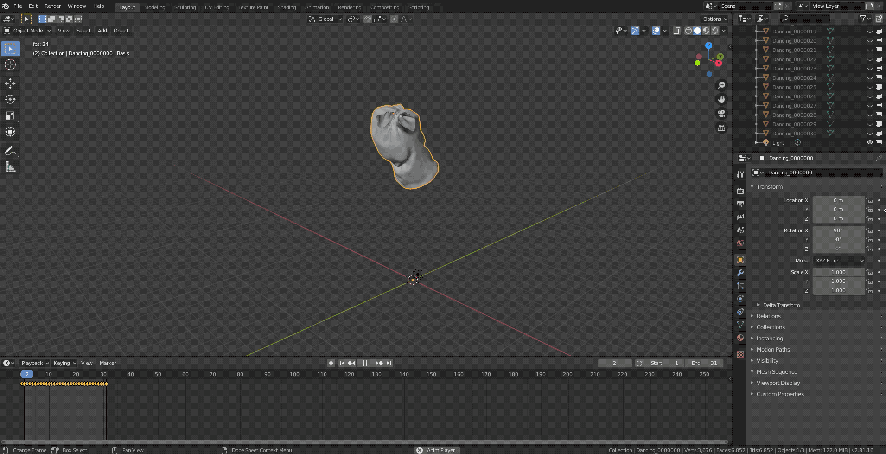

# MarvelousDesigner_Obj_Seq_To_FBX

## Are you suffering from a piles of obj sequence?
Here is a perfect solution! **Just add this blend add-on** and convert obj sequence to a single fbx file!  
|  |  |  |
|:---:|:---:|:---:|
| | >>> | |  

 
 
## How to use?

1. Install .zip file to blender.  

2. Check 3D View > Tools. You can find OBJSeqToFBX tab.  

3. Find directory of obj sequence. Set an output path and an output file name.  

4. Hit 'Convert to FBX'! You can see a result like below  
 

## Test

You can test this add-on using test data set ('./TestSet')  
Set input dir to './TestSet' and test.  
You can see result like following image.  

## Issues

Please feel free to leave an issue if there is any problem!
